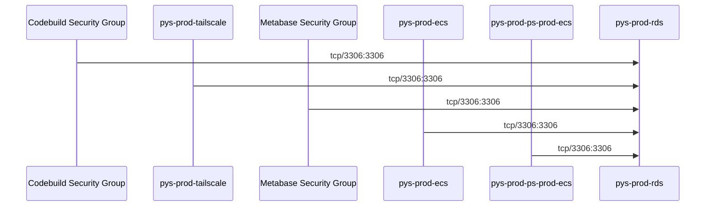

# mermaid-security-groups

NAME

    `mermaid-security-groups` - Draw a Mermaid diagram of AWS security groups

SYNOPSIS

    `node ./index.js [--profile AWS_PROFILE] [--filter SG_ID1,SG_ID2,...]`

DESCRIPTION

    Draws a Mermaid diagram of the ingress rules for the specified
    security groups (or all groups if no `--filter` is applied.)
